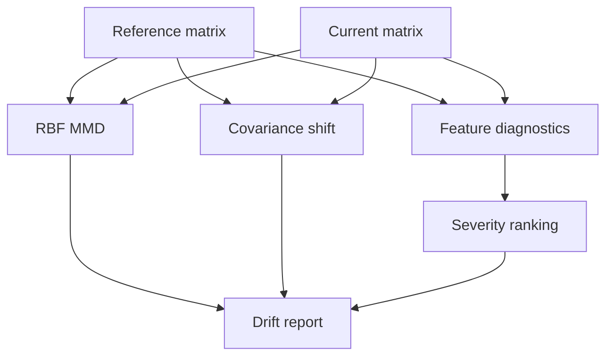

# Architecture

```mermaid
flowchart TB
    R[Reference matrix] --> F[Feature diagnostics]
    C[Current matrix] --> F
    R --> M[RBF MMD]
    C --> M
    R --> V[Covariance shift]
    C --> V
    F --> S[Severity ranking]
    M --> O[Drift report]
    V --> O
    S --> O
```

Feature metrics and global metrics are computed independently so a single shifted column cannot be hidden inside one aggregate score.
